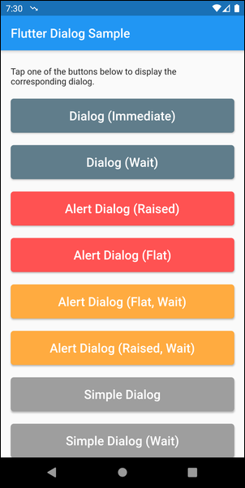

# Flutter Dialog Sample

After reading a bunch of articles about how to add Dialogs to Flutter applications, I decided to make a sort of kitchen sink Flutter app that demonstrated all the ways to create simple dialogs using Flutter. I grabbed a bunch of samples from the Internet and plugged them in until I had (simple) dialogs figured out.

The screen shot below shows the app home page. It essentially lists a bunch of buttons, each of which displays a Flutter Dialog a different way. My code doesn't do anything with the user's selection in the dialog, but it shouldn't be hard to add that as needed in your own apps.



Most of the examples I found on the Internet displayed non-modal dialogs: in other words, the dialog would open then the app contiues execution. For some of my apps, I needed modal dialogs that interrupt app flow until the acts in the dialog, so I added non-wait and wait versions of each dialog so I could demonstrate how to do dialogs both ways.

By default, Flutter dialogs allow users to tap outside of the dialog to dismiss it. That's unexpected behavior in my eyes, so I added the following to each call to `showDialog` to force the user (you) to interact with the dialog by tapping one of the buttons before the dialog closes.

```dart
barrierDismissible: false, // user must tap a button to close the dialog
```

Flutter's base `Dialog` class has a lot more capabilities than I show here mostly because I don't need fancy dialogs or interactive forms for the apps I'm creating now. Perhaps I'll add that later.

Enjoy the sample app.

***

By [John M. Wargo](http://www.johnwargo.com) - If you find this code useful, and feel like thanking me for providing it, please consider making a purchase from [my Amazon Wish List](https://amzn.com/w/1WI6AAUKPT5P9). You can find information on many different topics on my [personal blog](http://www.johnwargo.com). Learn about all of my publications at [John Wargo Books](http://www.johnwargobooks.com).